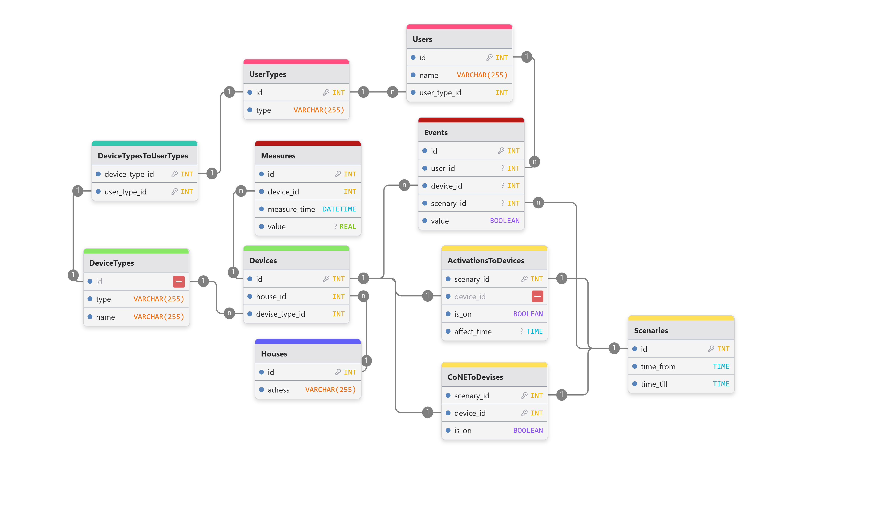

# Курсовой проект: «Сравнительный анализ подходов к разработке баз данных: классический SQL vs BaaS-платформа»

## Описание

Сравнение традиционного подхода к разработке реляционной базы данных "вручную" с использованием BaaS-платформы (Backend-as-a-Service) на примере Back4app

Предметная область: Система управления умным домом с иерархией прав

## SQL БД

Образ: mysql:8.0.16

Схема БД

## BaaS-платформа

Была использована [Back4app](https://www.back4app.com/)

## Реализовано

- [x] Схема БД в 3НФ
- [x] Генератор данных для SQL БД
- [x] Запросы на SQL
- [x] Консольное приложение
- [x] Классы в Back4app
- [x] Генератор данных для Back4app БД
- [x] Запросы с помощью Cloud Code
- [x] Консольное приложение
